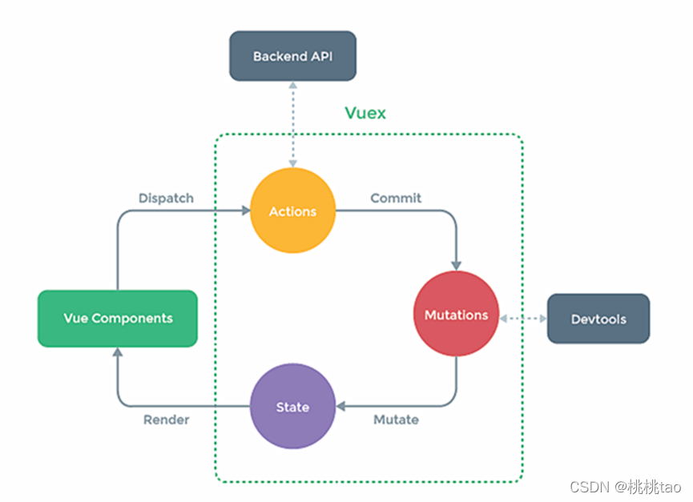

## 插件-68

规范:在src下写一个plugin.js文件 里面暴露对象 然后在**min.js里面 使用Vue.use来使用暴露的插件对象**,vue会自动帮我们调用这个插件里面的函数 (这个函数的第二个参数是 Vue的构造函数)

## scoped-69

**scoped(局部) 给style标签添加scoped代表局部生效**

**作用:让样式在局部生效,防止冲突**

原理:是给标签动态生成标签属性 style里再通过标签属性获取

注意 : 不要在app.vue里写 scoped 这样它就无法公共样式了(一般来说app.vue的样式是公共的)

## toDoList-70

**组件化编码流程**(通用)
1~实现静态组件:抽取组件,使用组件实现静态页面效果
2~展示动态数据:
					a:数据的类型,名称是什么?
					b:数据保存在哪个组件?
3~交互---从绑定事件监听开始

当我们点击编辑的时候 会出现input输入框,并且要自动聚焦,这里我们使用自定义指令 

directives: {

  focus: {

   // 指令的定义

   inserted: (*el*) => {

​    // 聚焦元素

​    *el*.querySelector('input').focus()

​    *el*.focus()

   }

  }

 },
注意,它会在元素产生的时候就执行 所以如果使用了 v-show 要换成v-if

**todolist保存勾选值**
有两种方式 :
1,使用element-ui 自带的保存方式 暂时没有学会
2,直接深度监听对象里面的布尔值,然后在选项表格里 使用template模板标签覆盖element选项表格
template 使用slot-scope='scope' 标签内写入checkbox 双向绑定scope.row.对应的布尔值
这个scope代表的是这一行的数据

## 组件自定义事件-80

props 也可以通过传递函数 来实现 子组件传递数据给父组件

**$emit** 组件上声明一个事件名称 v-on:事件名(@事件名) 在子组件中 通过this.$emit('事件名',传递值) 这种方式也可以实现子传父

**ref** 组件上声明ref 然后 通过this.$refs.名称.$on('事件名',回调函数)绑定事件名
**v-on和$refs.名称.$on都可以绑定事件 这两种方式都是通过子组件emit发射(个人理解是调用)**

**解绑自定义事件**
this.$off('事件名称') 解绑一个自定义事件
this.$off()解绑所有自定义事件
this.$destroy() 通过销毁当前组件实例,也会销毁到自定义事件(因为绑定到了组件的实例身上)

**组件原生事件** 
组件标签 使用原生事件 比如@click 等事件 会被当成自定义事件来使用 如果要在组件标签上使用原生事件,那么则需要在事件后面加上.native(@click.native)

## 全局事件总线-84

父传子用到了自定义事件传输  父组件内 给子组件绑定自定义事件名称 子组件内 调用事件 传递参数
父组件内就可以触发事件回调 得到值
如果兄弟组件或者其他关系的组件们进行传输 得可以用事件总线
直接给main.js 里面的 Vue构造函数中配置对象添加 
beforeCreate(){

  // 安装全局事件总线

  Vue.prototype.$bus = *this*

 }
**原理:还是用到的自定义事件 只不过我们给Vue原型上绑定了 vue实例 之后我们每一个组件都能拿到这个组件进行绑定自定义事件 也可以进行调用自定义事件发送数据**

## $nextTick-90

this.$nextTick(function) 回调会在下一次dom节点更新完毕之后执行 

## 动画效果

**原生css3 的一些动画**
@keyframes 动画名{
from{//这里面写开始的样式} 
to{这里写结束的样式} 
}
在一个样式里面写入 animation:动画名, 时间 ,顺序 来开始动画样式

写一个transition标签需要过渡动画的标签 transition标签可以给一个name值来代表局部生效
这是给了name值transiiton标签的 样式  注意:要在需要动画的标签 写过渡样式(transition)

## slot-102

### 1~默认插槽

想要在一个组件内插入一个标签 需要在这个组件内部用一个slot插槽标签来占位
这样父组件就能给子组件添加标签
slot标签和其他标签一样使用 如果在使用组件的时候 传入了标签或者其他组件,那么slot会被覆盖,他相当于就是对自己组件标签的一个占位标签,但是当自己组件在外部被使用并且传入了标签(或组件时)slot自己会被覆盖

**总结:**
组件标签在被使用时 又想给组件内部添加标签 那么在组件使用之前给内部 写一个slot 外部在使用时就可以给组件标签内写标签了

### 2~具名插槽

slot标签给一个name属性 然后给一个值
外部在使用组件标签时 插入的元素 需要给一个slot="slot的name值" 这样就代表往对应name值的插槽插入
**template插入**
template标签在渲染后会舍弃自身保留内部的元素 它就是一个用来包裹的外壳,template可以用来插入slot这样也不会生成多的标签
**template v-slot**: slot名 这是一个新的写法 和 slot="名称" 一样是vue2.6更新的写法

### 3~作用域插槽

数据在组件的自身,但数据生成的结构需要组件的使用者来决定
比如a组件要给b组件插入元素,但是要用到b组件的内的一些数据
那么就需要作用域插槽(也就是声明slot的组件给组件使用者传值)
b组件内

<slot :名称="变量"></slot>

a组件内使用template标签的scope来接收值 scope="自定义一个名称"
那么这个templat内的标签就能用到传递过来的数据了 这种方式的插槽是必须要template标签的

知识插入:

```jade
function test([a,b]){
	console.log(a,b)
}
function test2(a,b){
	console.log(a,b)
}
test(['key','value'],'done')//key,value
test2(['key','value'],'done')//['key','value'],'done'
形参内写方括号 优先用来结构实参里的数组
```

## vuex-105

vuex 专门在vue中实现**集中式状态(数据)管理**的一个vue**插件** 对vue应用中多个组件的共享状态进行集中式管理(读/写),也是一种组件间通信方式,且适应与任意组件间通信

**vuex有三个重要的组成部分(  Actions(动作)/ Muations(修改)/ Sate(状态) )**
state是一个对象

第一步调用 dispatch('动作',值)  >  Actions(这个对象会以key value的形式接受dispatch的参数)
actions对象内 的一个函数属性的key若是和dispatch的 
第一个参数相同 那么则会调用 然后这个函数会有一个值 这个值 就是dispatch的第二个参数  
这个函数同时也会调用 commit 然后Mutations里也有一个函数key为"动作" 然后里面有state以及我们传递的值

如果我们要修改一个值 同时需要调用后台接口发送请求时 就可以在actions里面做
所以它也可以不经过actions 直接调用Mutations 来进行修改



**actions的作用在于 在修改数据之前 做一些处理 比如需要判断 最重要的是 向后台发请求**
**若我们不需要做一些判断 也不需要对这个数据发请求 那么可以直接通过 Mutations进行修改**

